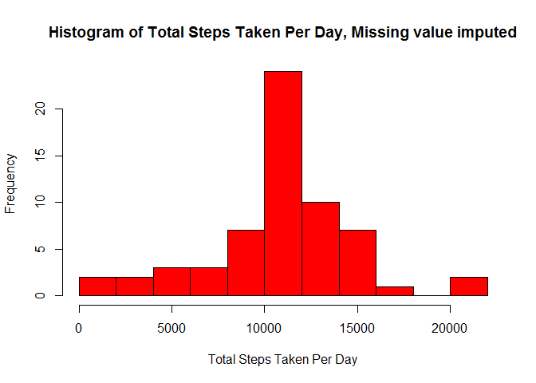

# Reproducible Research: Peer Assessment 1


## Loading and preprocessing the data

This chunk of code is for loading the data into R workspace.
Note: before excute it, remember to set the work directory to the local repository folder where the data is stored.


```r
## unzip the file
activity_CSV <- unzip("activity.zip")

## read data into R workspace
activity_data <- read.csv(activity_CSV, header=TRUE)
colnames(activity_data)
```

```
## [1] "steps"    "date"     "interval"
```

Here convert the date variable from factor to Date

```r
activity_data$date <- as.Date(activity_data$date)
```

## What is mean total number of steps taken per day?

### 1. Make a histogram of the total number of steps taken each day. (Ignoring the missing values)

The following code computes the total number of steps taken per day,and stores that into a new data frame: StepperDay

A ifelse function is used to teal with missing values (NA) in the original dataset:
    - if the steps measurements for a particular day are ALL missing, the total number of steps for that day is marked as missing value in the StepperDay data frame;
    - if the steps measured for a particular day are only PARTIALLY missing, the total number of steps for that day is computed as the sum up of the non-missing values in that day, with missing values being ignored.


```r
library(dplyr)
```

```
## Warning: package 'dplyr' was built under R version 3.1.3
```

```
## 
## Attaching package: 'dplyr'
## 
## The following object is masked from 'package:stats':
## 
##     filter
## 
## The following objects are masked from 'package:base':
## 
##     intersect, setdiff, setequal, union
```

```r
## Calculate the total number of steps taken per day
StepperDay <- group_by(activity_data, date) %>% summarize(
    ifelse(sum(!is.na(steps))>0, sum(steps, na.rm=TRUE), sum(steps, na.rm=FALSE)))

## Change column names
colnames(StepperDay) <- c("date", "total")
```

A histogram of the total number of steps taken per day is plotted as following: 

```r
hist(StepperDay$total, breaks = 10, col = "red",
     main = "Histogram of Total Number of Steps Taken Per Day",
     xlab = "Total number of Steps Taken Per Day")
```

 

### 2. The mean and median of total number of steps taken per day

The mean total number of steps taken per day is:

```r
mean(StepperDay$total, na.rm = TRUE)
```

```
## [1] 10766.19
```

The median total number of steps taken per day is:

```r
median(StepperDay$total, na.rm = TRUE)
```

```
## [1] 10765
```


## What is the average daily activity pattern?

### 1. Time series plot of averaged number of steps in 5-mins interval

The following piece of code computes the number of steps in 5-mins interval averaged across all measured days, and stores the results into a new data frame: Step_Interval

Missing values are dealt the same way as previous method by employing ifelse function:
    - if the steps measurements for a particular 5-mins interval are ALL missing, the mean step counts for that 5-mins interval is marked as missing value in the Step_Interval data frame;
    - if the steps measured for a particular 5-mins interval are only PARTIALLY missing, the mean step counts for that 5-mins interval is computed as the mean of the non-missing values, ignoring the missing values.
    

```r
Step_Interval <- group_by(activity_data, interval) %>% summarize(
    ifelse(sum(!is.na(steps))>0, mean(steps, na.rm=TRUE), mean(steps, na.rm=FALSE)))

## Rename column names
colnames(Step_Interval) <- c("interval", "mean")
```

Here a time series object is being created, which starts from 00:00:00 and ends at 23:55:00. It contains 288 elements, each element is 5 mins apart.
Note: the specified date and time zone does not matter for the purpose of plotting the desired time series figure, it is being set for a purpose of accurately and correctly forming the desired time series object.


```r
basedate <- activity_data$date[1]
basedatePOSIX <- as.POSIXlt(basedate, origin = "1970-01-01 00:00.00 UTC")
basedateNumeric <- as.numeric(basedatePOSIX)
basedateEnd <- basedateNumeric + (length(Step_Interval$interval)-1)*300
interval_ts_Numeric <- seq(basedateNumeric, basedateEnd, 300)
interval_ts <- as.POSIXlt(interval_ts_Numeric, tz="UTC", origin="1970-01-01 00:00.00 UTC")
```

The following piece of code plots the average daily activity pattern.


```r
plot(interval_ts, Step_Interval$mean, type="l",
     main="Average Daily Activity Pattern", xlab="time in a day", 
     ylab="steps per 5 mins(averaged across measured days)", lwd=2)
```

 

### 2. The 5-mins interval with maximum number of steps

The 5-mins interval which contains the maximum number of steps is:

```r
ind <- which(Step_Interval$mean == max(Step_Interval$mean))
#interval_ts[ind]
Step_Interval$interval[ind]
```

```
## [1] 835
```
Therefore the 5-mins interval with maximum number of steps is: 8:35 a.m.


## Imputing missing values

### 1. Total number of missing value counts

The total number of missing values in this dataset is:

```r
ind_NA <- is.na(activity_data$steps)
count_NA <- sum(ind_NA)
count_NA
```

```
## [1] 2304
```

### 2. Strategy for imputing missing values

The missing values are going to be filled with the mean step numbers (averaged across all days) of the corresponding 5-mins interval.
The following code is extracting each missing values' corresponding imputing mean from the Step_Interval data frame.


```r
interval_NA <- activity_data$interval[which(ind_NA)]
step_impute <- Step_Interval$mean[match(interval_NA,Step_Interval$interval)]
```

### 3. Create a new dataset with NAs filled

This chunk of code copies the original activity dataset into a new data frame - copy_activity, and fills in all the missing values based on the stratedy described above.


```r
copy_activity <- activity_data
copy_activity$steps[which(ind_NA)] <- step_impute
```

### 4. Evaluate the strategy for filling in missing values

The following script repeats the steps in first section on copy_activity data frame, and plot a histogram of total number of steps taken each day by using the dataset with missing values all filled.


```r
copy_StepperDay <- group_by(copy_activity, date) %>% summarize(sum(steps, na.rm=TRUE))

## Change column names
colnames(copy_StepperDay) <- c("date", "total")

## Plot the histogram of total steps per day
hist(copy_StepperDay$total, breaks = 10, col = "red",
     main = "Histogram of Total Steps Taken Per Day, Missing value imputed",
     xlab = "Total Steps Taken Per Day")
```

 

Comparing the histogram obtained from this section to the first section, the bar in the middle range has grown taller than without imputing missing values.

The mean of total steps taken each day after imputing missing data is:

```r
mean(copy_StepperDay$total)
```

```
## [1] 10766.19
```

It is the same value obtained in section one, before imputing missing data.

The median of total steps taken each day after imputing missing data is:

```r
median(copy_StepperDay$total)
```

```
## [1] 10766.19
```

It is slightly larger than the median that obtained in section one, before imputing missing data.

In summary, the devised stratedgy for filling in missing values does not change the mean total steps taken per day. However it increases the medain total steps taken per day, and moves its value towards the mean.
Therefore it is fair to say that the devised stratedgy for filling in missing values, moves the distribution median towards the distribution mean. And overall, it does not bring in a significantly change in the distribution of the total number of steps taken per day.


## Are there differences in activity patterns between weekdays and weekends?

### 1. Mutate a new variable into the dataset with missing values filled in

The following chunk of code mutate a new factor variable - weekdayInfo into copy_activity data frame. The weekdayInfo variable is used to specify the date is a "weekday" or a "weekend".


```r
copy_activity <- mutate(copy_activity, weekdayInfo = 
                   factor((sapply(date, weekdays, abbreviate=TRUE) %in% c("Sat", "Sun")),
               labels = c("weekday","weekend")))
```

This piece of code splits copy_activity into two different data frames by weekdayInfo.
In act_weekday, it only contains measurements on weekdays.
In act_weekend, it only contains measurements on weekends.


```r
Temp <- split(copy_activity, copy_activity$weekdayInfo)
act_weekday <- Temp[[1]]
act_weekend <- Temp[[2]]
```

The following code calculate the mean number of steps of every 5-mins interval, averaged across all days, for the two splitted data frames respectively.
Note: Since all missing values are imputed already, there is no need to set na.rm=TRUE when compute the mean.


```r
Step_weekday <- group_by(act_weekday, interval) %>% summarize(mean(steps))
colnames(Step_weekday) <- c("interval","mean")
Step_weekend <- group_by(act_weekend, interval) %>% summarize(mean(steps))
colnames(Step_weekend) <- c("interval","mean")
```

The last chunk of code plot a 2-panel figure, with the top panel displaying the average daily activity patterns at WEEKENDS, and the bottom panel showing the average daily activity patterns at WEEKDAYS.


```r
par(mfrow=c(2,1))
plot(interval_ts, Step_weekend$mean, type="l",
     main="Average Daily Activity Pattern at Weekends", xlab="time in a day", 
     ylab="No. of steps/5-mins", lwd=2)

plot(interval_ts, Step_weekday$mean, type="l",
     main="Average Daily Activity Pattern at Weekdays", xlab="time in a day", 
     ylab="No. of steps/5-mins", lwd=2)
```

 
